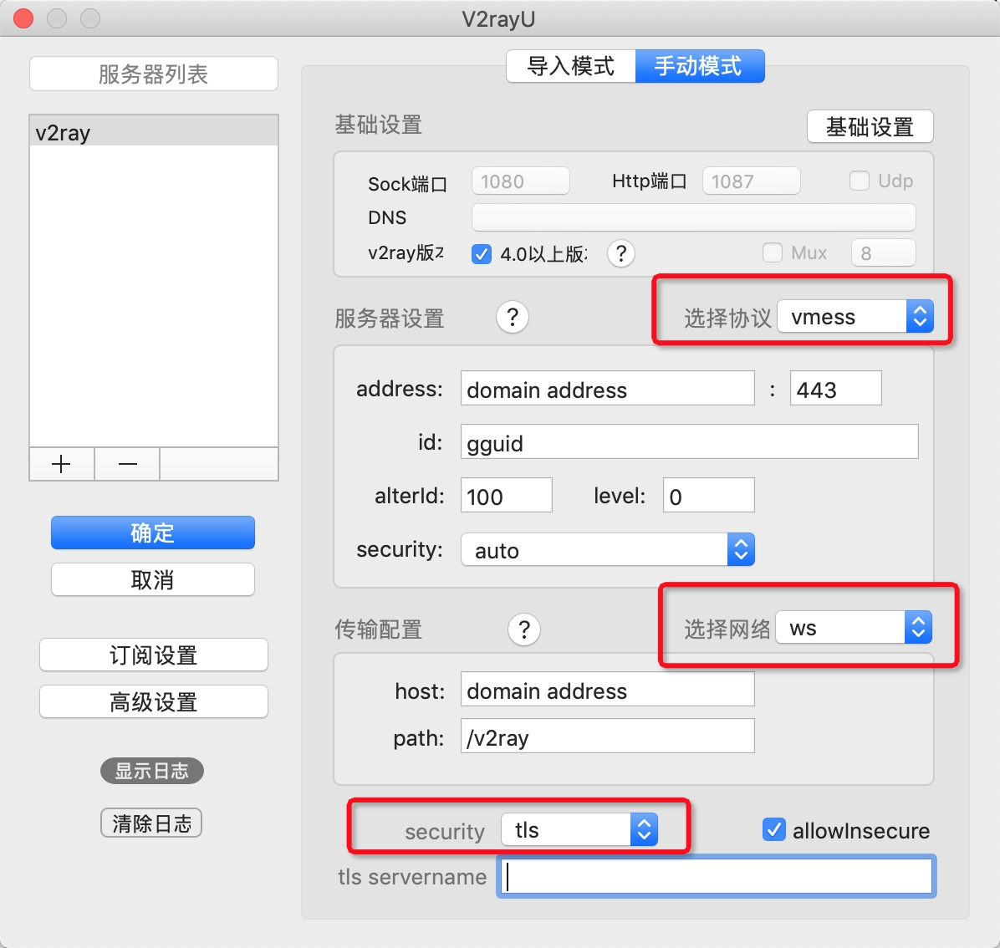

# V2Ray Docker 使用说明

### 准备工作（适用于新服务器）
1. 一个干净的服务器是缺少一些工具的，需要自己装一下，比如：wget、git、socat、docker、docker-compose 这些（具体咋装软件如有需要再补充吧），安装好后，克隆本项目，再把 docker 服务开起来；

2. 准备一个域名，免费域名经测试申请不了了，所以花点小钱买一个，然后把 A 记录解析改为你服务器 ip。

### 服务端
1. 使用 [GGUID](https://www.guidgen.com/) 生成一个 ID 标识，然后打开 `./v2ray/config.json` 文件，修改[第 9 行](https://github.com/wubaiqing/v2ray-docker-compose/blob/master/v2ray/config.json#L9)的 ID 标识；

2. 看这个说明安装 [acme.sh](https://github.com/Neilpang/acme.sh/wiki/%E8%AF%B4%E6%98%8E)，安装好后，按照说明申请证书，再把 `yourdomain.crt 和 yourdomain.key` 这两个重命名为 `v2ray.crt 和 v2ray.key`，把它们拷贝到 `./nginx/certs/` 目录下。

> **第 2 步最省心的方法看这：**
> 1、执行这个命令：`acme.sh --issue -d yourdomain.com --standalone`，就会在 `~/.acme.sh/` 目录下生成好证书。
> 2、执行这个命令：`acme.sh --install-cert -d yourdomain.com --key-file ./nginx/certs/v2ray.key --fullchain-file ./nginx/certs/v2ray.crt`，证书就装好啦。

3. 修改 `./nginx/conf.d/v2ray.conf` [第 8 行](https://github.com/wubaiqing/v2ray-docker-compose/blob/master/nginx/conf.d/v2ray.conf#L8) 的域名地址。

4. 启动临时服务测试一下：`docker-compose up`，如果测试没问题，把这服务关了，执行这个开启服务：`docker-compose up -d`

### 客户端
1. 从 [神一样的工具们](https://www.v2ray.com/awesome/tools.html) 下载当前环境的客户端；
2. 按下图设置客户端即可：

### 资源
GGUID 生成器：https://www.guidgen.com/  
免费域名：https://www.freenom.com/zh/freeandpaiddomains.html  
acme.sh：https://github.com/Neilpang/acme.sh/wiki/%E8%AF%B4%E6%98%8E